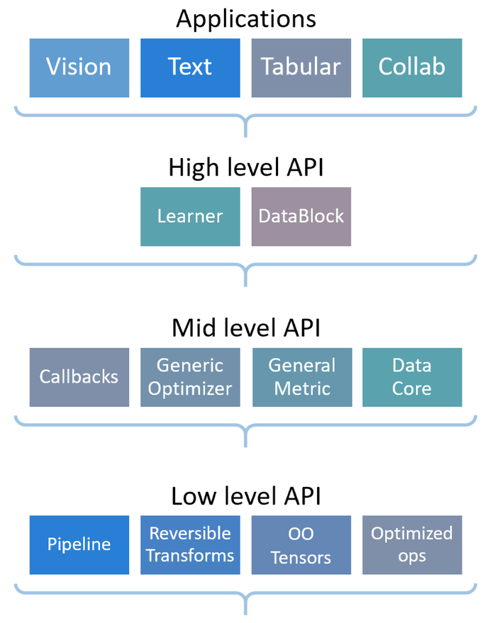

fastai: High-Level ML Library
==================================

Overview
---------------------

fastai is built on top of Pytorch. It is built on top of a hierarchy 
of lower-level APIs which provide composable building blocks. 

This way, a user wanting to rewrite part of the high-level API or add 
particular behavior to suit their needs does not have to learn how to 
use the lowest level.

fastai's applications all use the same basic steps and code:

1. Create appropriate DataLoaders
2. Create a Learner
3. Call a fit method
4. Make predictions or view results.

There are rough three categories of problems:

- vision
- text
- tabular: structured, dense table
- collab/recommendation system: unstructured, sparse

Pipeline
-------------------------

Just a list of function to apply?

.. code-block:: python

    pets = DataBlock(
        blocks=(ImageBlock, CategoryBlock), 
        get_items=get_image_files, 
        splitter=RandomSplitter(),
        get_y=Pipeline([attrgetter("name"), RegexLabeller(pat = r'^(.*)_\d+.jpg$')]),
        item_tfms=Resize(128),
        batch_tfms=aug_transforms()
    )

Resources:
-----------------------

- `Official Website <https://docs.fast.ai/>`_

Details
=======================

.. toctree:: 

    datablock
    vision
